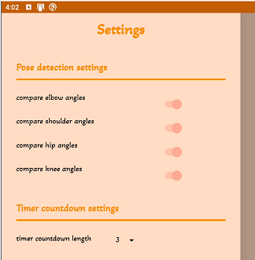

# Pose matching game

Our goal for Hackathon 2021 was to create an app where users could use the Surface Duo to match poses!

## Tools

- [Google's ML Kit for Pose Detection](https://developers.google.com/ml-kit/vision/pose-detection/android)
- [CameraX](https://developer.android.com/training/camerax)
- [Jetpack Compose](https://developer.android.com/jetpack/compose)
- [Jetpack Window Manager](https://docs.microsoft.com/en-us/dual-screen/android/jetpack/window-manager/)

## Game information

### Instructions

This app is intended to be used in [Dual Portrait](https://docs.microsoft.com/dual-screen/introduction#dual-screen-overview) mode for the best experience.

### Overview

1. When the game starts, users can select reference images to appear on the left screen, and then in the right screen, they are able to see themselves in a camera view.
2. When they are ready to attempt matching the pose, they can click the **Take Photo** button to start a timer countdown.

3. At the end of the countdown, the reference image and camera view are both analyzed with a pose-detecting library, specifically [Google's ML Kit](https://developers.google.com/ml-kit/vision/pose-detection/android). This library generates two skeletons with landmarks representing various joints.
4. The angles of the four main joints (elbows, shoulders, hips, and knees) are compared, and the angle differences are used to calculate a score out of 100.
5. Depending on how many reference images were selected, the user can then continue on to the next image in the sequence or view their final score and start a new game session. If a sequence of images was used to play, the final score is calculated by taking the average of the scores.

### Game options

**Pose selection**: Users can simply start playing with the default poses we included in the app, or they can choose any reference image from their own photo library.

**Reference image sequence**: Similarly, users can simply start playing with a pre-generated sequence of default poses, create their own sequence of reference images, or play by matching one pose at a time.

## Hack highlights

### Machine learning exposure

Neither of us have previous experience with ML/AI, so it was really interesting to learn about the MLKit library and test out the pose detection features.

### Figma design elements

Something that we also wanted to familiarize ourselves with was Figma. We ended up designing our app icon and different vector resources for the app using Figma, which was a great learning experience.

### Accessibility

One issue we thought of when coming up with our hack idea was the accessibility of the game. We tried brainstorming solutions on how to make it more accessible to people with limited mobility, missing limbs, or other disabilities, and one enhancement we added was a **Settings** menu that affects how poses are compared. Users can control which joint angles are compared and how long the timer takes to count down, which we hoped would help improve game play for everyone.

## If we had more time...

If we had more time/resources to work on this project, here are some things we would work on next:

- **Support for other layouts/orientations**: adding support for landscape and single-screen game play would give users more flexibility when using the app
- **Increased accessibility**: even though we came up with a small improvement to accessibility, we think that the app could benefit from additional adaptations to be more inclusive
- **Analyze live video**: the MLKit provides support for analyzing both photos and live video, so it would be interesting to add live video support to the app - maybe it could even be used for applications like learning dances or other complex movements
- **Analyze drawings**: the MLKit also provides support for ink analysis, and inking is one of the highlighted experiences on the Surface Duo, so it would also be cool to have a game where users have to copy drawings
- **Design**: although our Figma experimentation was fun, having a professional designer on the team would improve app appearance and user experience
